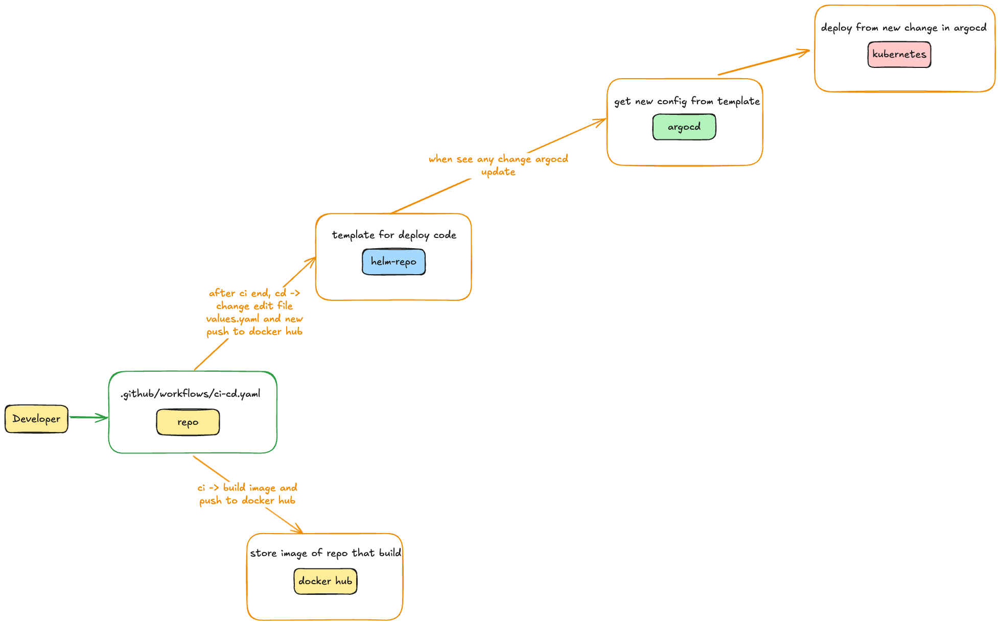

## Note for setup ci/cd 



- project repo : https://github.com/tochratana/reactjs-template and for configuration or ci/cd file must be in `.github/worflows/....yaml`

```yaml
on:
  push:
    branches:
      - master

# Environment use for create variable for use in this pipeline
env: 
  DOCKER_IMAGE_NAME: reactjs-template # image name in docker hub
  HELM_REPO: tochratana/helm-argocd # repo that store template
# build docker image and push to docker hub
jobs:
  ci-jobs:

    # runs-on mean select machines for run this pipeline, normaly it have two type of this (github machines, and self hosted machines)
    runs-on: ubuntu-latest
    environment: DOCKER_ENV # setting > Environment > create environment
    steps:
      - name: Checkout code
        uses: actions/checkout@v3
      - name: Use with SHA 
        run: | 
          echo "TAG=${GITHUB_SHA::8}" >> $GITHUB_ENV
      - name: Show the new tags value
        run: |
          echo "Tag value is: ${{ env.TAG }}"
      # login to docker hub
      # setting > Environment(create new environment) > add screte (USERNAME, PASSWORD)
      # PASSWORD can be token from docker hub
      - name: Login to Dockerhub
        run: |
          echo "${{ secrets.PASSWORD }}" | docker login -u ${{secrets.USERNAME}} --password-stdin
      
      # Build docker image mean build and -t > tag already     
      - name: Build Docker image and tag
        run: docker build -t ${{ secrets.USERNAME }}/${{ env.DOCKER_IMAGE_NAME }}:${{ env.TAG }} .
      - name: Push to Docker hub
        run: docker push ${{ secrets.USERNAME }}/${{ env.DOCKER_IMAGE_NAME }}:${{ env.TAG }}
      - name: Logout from Dockerhub
        if: always()
        run: |
          docker logout
# update helm repo with new imagejobs:
  cd-jobs: 
    needs: ci-jobs
    runs-on: ubuntu-latest 
    environment: HELM_ENV
    steps: 
      - name: Install yq command 
        # install yq commnd for easy to work with file
        run: |
          wget https://github.com/mikefarah/yq/releases/latest/download/yq_linux_amd64 -O /usr/local/bin/yq
          chmod +x /usr/local/bin/yq
      - name: Add Commit SHA to TAG env 
        run: |
          echo "TAG=${GITHUB_SHA::8}" >> $GITHUB_ENV
      
      # clone the helm repo remporarily 
      # for helm repo should be create in setting > Environment > create new environment
      - name: Clone argocd repo 
        run: | 
          git clone https://github.com/${{ env.HELM_REPO }} helm_repo 

      # update helm chart after have new config or edit code
      - name: Update Helm Chart 
      # for cd if in template repo have chart, shoud be cd in chart
      # DOCKER_USERNAME is in HELM_REPO
      # GET_TOKEN is token from github in Fine-grained personal access tokens(contnets -> read/write, workflow -> read/write)
        run: |
          cd helm_repo

          echo "Update repository username/imagename "

          yq -i ".image.repository=\"${{ secrets.DOCKER_USERNAME }}/${{ env.DOCKER_IMAGE_NAME}}\"" values.yaml

          echo "Update image tag "
          yq -i ".image.tag=\"${{ env.TAG }}\"" values.yaml

          git config --global user.email "username@example.com"
          git config --global user.name "dummyname"
          git add . 
          git commit -m "Update helm to use image ${{ env.TAG }}"
          
          git push https://${{ secrets.GIT_TOKEN }}@github.com/${{ env.HELM_REPO }}
      
      - name: Clean up 
        run: | 
          rm -rf helm_repo
```
- template repo : https://github.com/tochratana/helm-argocd for values.yaml file should be like this 
```yaml
# Default values for next-chart.
# This is a YAML-formatted file.
# Declare variables to be passed into your templates.

# This will set the replicaset count more information can be found here: https://kubernetes.io/docs/concepts/workloads/controllers/replicaset/
replicaCount: 1
# This sets the container image more information can be found here: https://kubernetes.io/docs/concepts/containers/images/
image:
  repository: tochratana/reactjs-template
  # This sets the pull policy for images.
  pullPolicy: IfNotPresent
  # Overrides the image tag whose default is the chart appVersion.
  tag: "44276a3b"
# This is for the secrets for pulling an image from a private repository more information can be found here: https://kubernetes.io/docs/tasks/configure-pod-container/pull-image-private-registry/
imagePullSecrets: []
# This is to override the chart name.
nameOverride: ""
fullnameOverride: ""
# This section builds out the service account more information can be found here: https://kubernetes.io/docs/concepts/security/service-accounts/
serviceAccount:
  # Specifies whether a service account should be created
  create: true
  # Automatically mount a ServiceAccount's API credentials?
  automount: true
  # Annotations to add to the service account
  annotations: {}
  # The name of the service account to use.
  # If not set and create is true, a name is generated using the fullname template
  name: ""
# This is for setting Kubernetes Annotations to a Pod.
# For more information checkout: https://kubernetes.io/docs/concepts/overview/working-with-objects/annotations/
podAnnotations: {}
# This is for setting Kubernetes Labels to a Pod.
# For more information checkout: https://kubernetes.io/docs/concepts/overview/working-with-objects/labels/
podLabels: {}
podSecurityContext: {}
# fsGroup: 2000

securityContext: {}
# capabilities:
#   drop:
#   - ALL
# readOnlyRootFilesystem: true
# runAsNonRoot: true
# runAsUser: 1000

# This is for setting up a service more information can be found here: https://kubernetes.io/docs/concepts/services-networking/service/
service:
  # This sets the service type more information can be found here: https://kubernetes.io/docs/concepts/services-networking/service/#publishing-services-service-types
  type: ClusterIP
  # This sets the ports more information can be found here: https://kubernetes.io/docs/concepts/services-networking/service/#field-spec-ports
  port: 80
# This block is for setting up the ingress for more information can be found here: https://kubernetes.io/docs/concepts/services-networking/ingress/
ingress:
  enabled: true
  className: nginx
  annotations:
    cert-manager.io/cluster-issuer: letsencrypt-prod

  hosts:
    - host: nginx-test-lg.tochratana.com
      paths:
        - path: /
          pathType: Prefix

  tls:
    - secretName: nginx-demo-tls
      hosts:
        - nginx-test-lg.tochratana.com
resources: {}
# We usually recommend not to specify default resources and to leave this as a conscious
# choice for the user. This also increases chances charts run on environments with little
# resources, such as Minikube. If you do want to specify resources, uncomment the following
# lines, adjust them as necessary, and remove the curly braces after 'resources:'.
# limits:
#   cpu: 100m
#   memory: 128Mi
# requests:
#   cpu: 100m
#   memory: 128Mi

# This is to setup the liveness and readiness probes more information can be found here: https://kubernetes.io/docs/tasks/configure-pod-container/configure-liveness-readiness-startup-probes/
livenessProbe:
  httpGet:
    path: /
    port: http
readinessProbe:
  httpGet:
    path: /
    port: http
# This section is for setting up autoscaling more information can be found here: https://kubernetes.io/docs/concepts/workloads/autoscaling/
autoscaling:
  enabled: false
  minReplicas: 1
  maxReplicas: 100
  targetCPUUtilizationPercentage: 80
  # targetMemoryUtilizationPercentage: 80
# Additional volumes on the output Deployment definition.
volumes: []
# - name: foo
#   secret:
#     secretName: mysecret
#     optional: false

# Additional volumeMounts on the output Deployment definition.
volumeMounts: []
# - name: foo
#   mountPath: "/etc/foo"
#   readOnly: true

nodeSelector: {}
tolerations: []
affinity: {}
```
